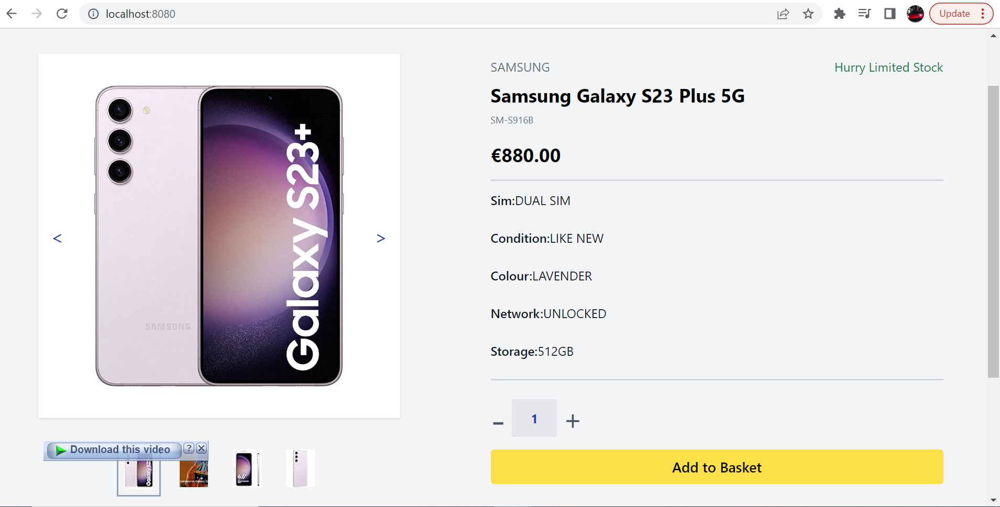

# Vue Project Documentation

## Table of Contents

1. [Introduction](#introduction)
2. [Setup Guide](#setup-guide)
3. [Demo](#demo)
4. [Tech Stack](#tech-stack)
5. [Project Overview](#project-overview)
6. [Usage](#usage)

## Introduction

Welcome to the official documentation for our Vue.js project. This document provides essential information about the project, including its setup guide, technology stack, and an overview of the project's purpose and features.

## Setup Guide

### Prerequisites

Before you begin, make sure your development environment is properly set up. You will need:

- [Node.js](https://nodejs.org/): Ensure Node.js is installed. You can check the version using `node -v`.
- [npm](https://www.npmjs.com/): Make sure npm is available. You can verify its version with `npm -v`.

### Installation

1. **Clone the Repository**

   ```bash
   git clone https://github.com/yourusername/your-vue-project.git

   ```
2.  **Navigate to the Project Directory**

cd your-vue-project
Install Dependencies

```bash
npm install
```
3. **Run the Development Server**

To start the local development server, use:

```bash
npm run serve
```
You can access the project in your web browser at http://localhost:8080.

4. **Build for Production**

When you're ready to deploy the project, execute the following command to build for production:

```bash
npm run build
```
The production-ready files will be located in the dist directory.

## Demo
[](https://www.loom.com/share/aacad1cfb60e47dead84e429dc04d102?sid=61fdd7f9-85c1-46cf-b378-ac282d0538ce)

Click on the image above to watch a demo of our project in action.

I have deployed it to Netlify, you can check it out on the following link: https://653ea9cb476a61250864a435--clever-souffle-bce707.netlify.app/


## Tech Stack
Our project utilizes a robust technology stack, including:

- Vue.js: A progressive JavaScript framework for building user interfaces.
- TailwindCSS: A modern CSS library, with responsive at scale
- Webpack: A popular build tool for bundling and managing assets.
- Babel: For transpiling JavaScript to ensure cross-browser compatibility.
## Project Overview

### Purpose
Our project serves the following primary purposes:

The Single Product page with Image Zoom feature which enhances the user experience on an E-commerce website by allowing customers to interact with product images and videos. This feature is designed to work seamlessly across different screen sizes and devices.
### Key Features
Our application boasts several key features, including:
Dektop Product View
Mobile Product View
Product Slider
Slider (Swipe for mobile)
Product Popover
Thumbnails

Supported Media: Image/Videos

Usage
We've provided detailed instructions on how to use our application, as well as additional information that may prove helpful to users.
